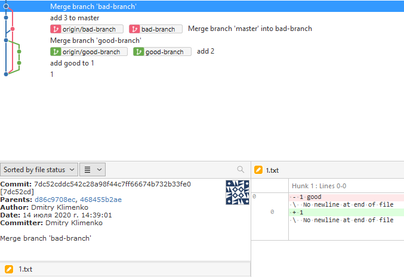

# git-issue-lost-changes

Когда мержим `master` в `bad-branch` специально ошибаемся и затираем `good` из `1.txt`

Гит это воспринимает как намеренное действие.

В результате, когда мержим `bad-branch` в `master` конфликта не происходит. Потому что "общий предок" - это как раз коммит после мержа с ошибкой. Для гита - это явно сделанные изменения.

Но по результату мержа `bad-branch` в `master` видим разную историю файла с отслеживанием по переименованию (`--follow`).

#### А где мои изменения?
```
$ git log -- 1.txt
commit 7bf2c33678a611b60091c8a4b7b81b1d48379bf5
Author: Dmitry Klimenko
Date:   Tue Jul 14 14:05:44 2020 +0300

    1
```

#### А почему текущий файл не такой как в последнем коммите в истории?
```
$ git log --follow -- 1.txt
commit 06707cf573500d1b3b4629773b03ad0d51f4f82c
Author: Dmitry Klimenko 
Date:   Tue Jul 14 14:29:00 2020 +0300

    add good to 1

commit 7bf2c33678a611b60091c8a4b7b81b1d48379bf5
Author: Dmitry Klimenko 
Date:   Tue Jul 14 14:05:44 2020 +0300

    1
```

#### Но не в одной истории мы не видим вот этого реально последнего изменения



## Найденное решение
```
$ git log --full-history -- 1.txt
commit 7dc52cddc542c28a98f44c7ff66674b732b33fe0
Merge: d86c970 468455b
Author: Dmitry Klimenko
Date:   Tue Jul 14 14:39:01 2020 +0300

    Merge branch 'bad-branch'

commit 468455b2aed7db230b90158868d491fd7f800d72 (bad-branch)
Merge: 7bf2c33 f141f55
Author: Dmitry Klimenko
Date:   Tue Jul 14 14:36:39 2020 +0300

    Merge branch 'master' into bad-branch

commit f141f555999d0b8d62170def8abedaa1f50c7dde
Merge: 7bf2c33 69d8f5c
Author: Dmitry Klimenko
Date:   Tue Jul 14 14:34:24 2020 +0300

    Merge branch 'good-branch'

commit 06707cf573500d1b3b4629773b03ad0d51f4f82c
Author: Dmitry Klimenko
Date:   Tue Jul 14 14:29:00 2020 +0300

    add good to 1

commit 7bf2c33678a611b60091c8a4b7b81b1d48379bf5
Author: Dmitry Klimenko
Date:   Tue Jul 14 14:05:44 2020 +0300

    1

```
